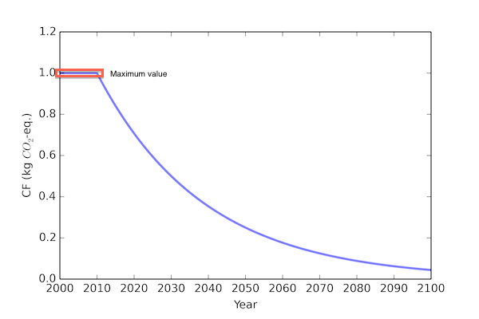

The best-first traversal
========================
In Temporalis the supply chain graph is traversed starting from the functional unit. During the traversal the amount of each input, when that input occurs and the biosphere flows for each process exchange are determined using convolution. 

Each exchange is evaluated for how much of the maximum possible LCA score it (could) contribute, with the most (potentially) damaging exchanges that are evaluated first. 

The traversal through the supply chain continue until either the impact of a particular exchange falls below the cutoff criteria (by default, 0.1% of the total possible impact), or until the maximum number of traversal steps has been reached (by default, 10.000). We can also lower the cut-off numeric criteria to make sure we aren't prematurely excluding any supply chain branches, but at the expenses of running time.

Benefits 
--------

The first obvious benefit is that we can include both relative and absolute dates. Because we would manually traverse the supply chain graph, we can have certain activity datasets happen at absolute dates. This could be especially helpful e.g. for infrastructure built in the past or data coming from sampling.

Another advantage is that there is no fixed time steps. Each exchange can have an absolute or relative time difference of arbitrary precision.

Finally, this approach more closely builds on the existing foundation of Brightway2, making it easier to program and test.

Drawbacks
---------

Graph traversal, like power series expansion, can only approximate the solution to a set of linear equations. An infinite number of graph traversal steps would be required to get the precise solution. However, in most cases graph traversal will converge on the precise answer relatively quickly.

Loops
-----

The treatment of the technosphere matrix as a graph can be problematic due to its cyclic nature, which can make the traversal infinite without any stop condition. 

In fact, supply chain graphs include loops (e.g. steel needed to generate electricity needed to make steel), and as such can be traversed without end. Cut-off criteria are needed to tell the traversal algorithm that no more work on this particular input is needed

.. ~, as almost all of its impacts have already been accounted for. Similarly, power series expansion must stop after some number of calculations. 

When loops are ecountered, Temporalis continue to travese them until the impact of the node falls below the LCA cutoff or the loop is repeated a certain amount of times (by default 10 times).

Worst-case approach
-------------------

The first step to do before solving the inventory is to choose the Impact assessmenet (IA) method that will be used for the LCA. When it is dynamic (i.e. the characterization factors can vary with time) we use the `worst-case approach` and create a "worst-case" IA method where the maximum possible value of each characterization factor is assessed. This IA method **must** be used to solve the inventory.

With static characterization factors the use of the best-first traversal is relatively easy since we just use them, with dynamic ones we need to be a bit more clever. In fact, we cannot know beforehand what the total LCA score of the functional unit assessed is. Dynamic characterization factors vary throughout time and thus their values are dependent on the time each biosphere flow is emitted which, in turn, cannot be known before solving the inventory. 

However, we can estimate the *upper bound* of what that score could be by doing a standard LCA calculation and applying the **highest** possible characterization factors (i.e worst-case IA method). This IA method is used in the best-first traversal to solve the inventory because, if an input is not important (in the sense of contributing to the total LCA score) applying even the highest possible characterization factors, then we can safely exclude it.

